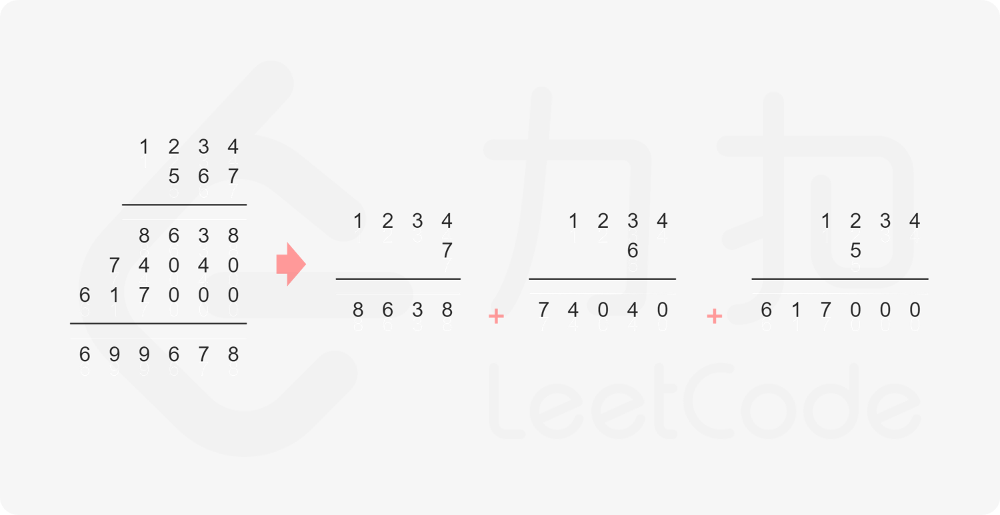
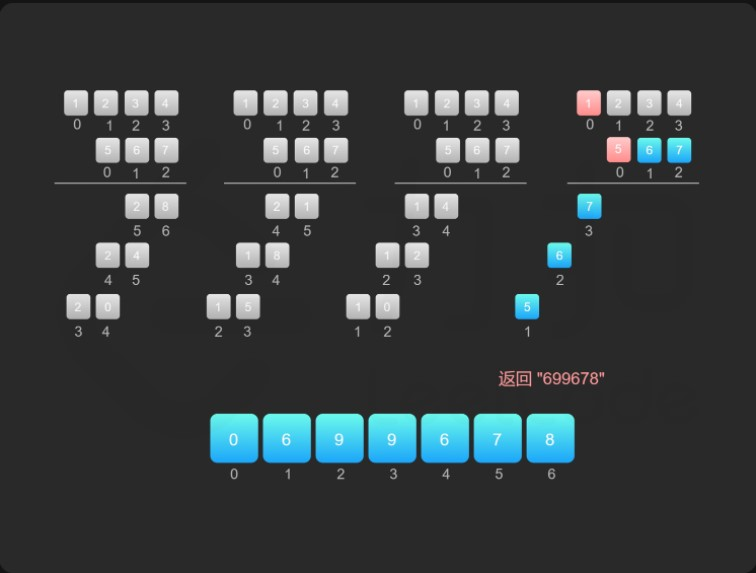

### 方法一：做加法

* 如果`num1`和`num2`之一是`0`，则直接将0作为结果返回即可。
* 如果1num1和num2都不是0，则可以通过模拟「竖式乘法」的方法计算乘积。从右往左遍历乘数，将乘数的每一位与被乘数相乘得到对应的结果，再将每次得到的结果累加。这道题中，被乘数是num1，乘数是num2。
* 需要注意的是，num2除了最低位以外，其余的每一位的运算结果都需要补0。

#### `复杂度分析`

* 时间复杂度：O(mn+n^2)，其中m和n分别是num1和num2的长度。需要从右往左遍历num 
2，对于num2的每一位，都需要和num1的每一位计算乘积，因此计算乘积的总次数是mn。字符串相加操作共有n次，相加的字符串长度最长为m+n，因此字符串相加的时间复杂度是O(mn+n^2)。总时间复杂度是O(mn+n^2)。

* 空间复杂度：O(m+n)，其中m和n分别是num1和num2的长度。空间复杂度取决于存储中间状态的字符串，由于乘积的最大长度为m+n，因此存储中间状态的字符串的长度不会超过m+n。

### 方法二、做乘法
方法一的做法是从右往左遍历乘数，将乘数的每一位与被乘数相乘得到对应的结果，再将每次得到的结果累加，整个过程中涉及到较多字符串相加的操作。如果使用数组代替字符串存储结果，则可以减少对字符串的操作。

令m和n分别表示num1和num2的长度，并且它们均不为0，则num1和num2的乘积的长度为m+n−1或m+n。简单证明如下：

* 如果num1和num2都取最小值，则num1=10^m−1，num2=10^n−1，num1 × num2=10^m+n−2，乘积的长度为m+n−1；

* 如果num1和num2都取最大值，则num1=10^m−1，num2=10^n−1，num1 × num2=10^m+n−10^m−10^n+1，乘积显然小于 10^m+n且大于10^m+n−1，因此乘积的长度为 m+n。

* 由于num1和num2的乘积的最大长度为m+n，因此创建长度为m+n的数组ansArr用于存储乘积。对于任意0 ≤ i < m 和0 ≤ j < n，num1[i] × num2[j]的结果位于ansArr[i+j+1]，如果ansArr[i+j+1] ≥ 10，则将进位部分加到ansArr[i+j]。

* 最后，将数组ansArr转成字符串，如果最高位是0则舍弃最高位。

