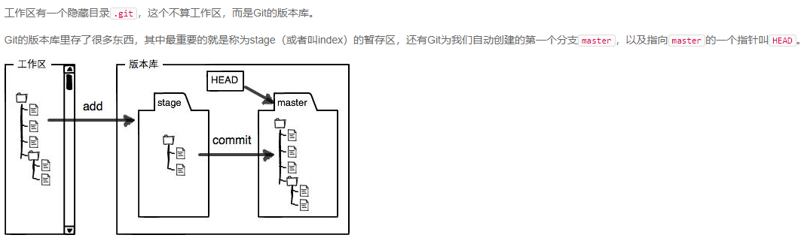
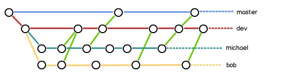

## git笔记

### 创建版本库
* 选择一个合适的地方，创建一个空目录，通过`git init`命令把这个目录变成Git可以管理的仓库。`也不一定必须在空目录下创建Git仓库，选择一个已经有东西的目录也是可以的。`

* 所有的版本控制系统，其实只能跟踪文本文件的改动，比如TXT文件，网页，所有的程序代码等等，Git也不例外。

* 然后在仓库中，进行各种操作，创建文件，修改文件，删除文件等等一系列操作

* 把修改放到Git仓库只需要两步。
第一步，用命令`git add`告诉Git，把文件添加到仓库
第二步，用命令`git commit`告诉Git，把文件提交到仓库

### 版本回退

* `git log --pretty=oneline`查看提交记录

* 在Git中，用HEAD表示当前版本，也就是最新的提交1094adb...（注意我的提交ID和你的肯定不一样），上一个版本就是HEAD^，上上一个版本就是HEAD^^，当然往上100个版本写100个^比较容易数不过来，所以写成HEAD~100。

* `git reset --hard HEAD^` 回退到上一个版本

* Git提供了一个命令`git reflog`用来记录你的每一次命令，根据打印出的结果可以查看到`commit id`，即每行结果行首的几位连续的16进制数字，这样你就可以使用`git reset --hard commitID` 回到未来某个版本

* 现在总结一下：
  1. HEAD指向的版本就是当前版本。Git允许我们在版本的历史之间穿梭，使用命令`git reset --hard commit_id`。

  2. 回退前，用`git log`可以查看提交历史，以便确定要`回退`到哪个版本。

  3. 要重返未来，用`git reflog`查看命令历史，以便确定要回到未来的哪个版本。

### 工作区和暂存区

* 仓库内部就是工作区

* 

* `git status` 查看仓库状态

* `git add`命令实际上就是把要提交的所有修改放到暂存区（Stage），然后，执行`git commit`就可以一次性把暂存区的所有修改提交到分支。

### 管理修改
* Git跟踪并管理的是修改，而非文件。什么是修改？比如你新增了一行，这就是一个修改，删除了一行，也是一个修改，更改了某些字符，也是一个修改，删了一些又加了一些，也是一个修改，甚至创建一个新文件，也算一个修改。

* `git add`将工作区修改添加到暂存区，`git commit`将暂存区修改提交，因此，提交之前一定要add工作区的修改，因为每次修改，如果不用git add到暂存区，那就不会加入到commit中。

* `git add file ---> git commit -m 'details about commit'`

* 用`git diff HEAD -- file`命令可以查看工作区和版本库里面最新版本的区别

### 撤销修改
* 场景1：当你改乱了工作区某个文件的内容但还没有add到暂存区，想直接丢弃工作区的修改时，用命令`git checkout -- file`或者 `git restore <file>`

* 场景2：当你不但改乱了工作区某个文件的内容，还添加到了暂存区时，想丢弃修改，分两步，第一步用命令`git reset HEAD <file>` 或者 `git restore --staged <file>`，就回到了场景1，第二步按场景1操作。

* 场景3：已经提交了不合适的修改到版本库时，想要撤销本次提交，参考版本回退一节，不过前提是没有推送到远程库。

* `git restore --staged <file>...` 可以将一个或者多个文件从暂存区撤销掉（新版本的命令）
* `git reset HEAD <file>` 可以将一个或者多个文件从暂存区撤销掉（老版本的命令）

### 删除文件

1. 当你直接在工作区delete掉文件之后，git就知道你删除了哪些文件，此时工作区与版本库产生了差异，这时你有两个选择：
  * 一是执行`git rm <file>`，并且执行`git commit`命令去删除版本库对应的文件，保持工作区和版本库一致。
  * 二是使用`git restore <file>`或者`git checkout -- <file>`撤销对工作区的修改，把删除的文件还原，这样也可以保持工作区和版本库一致。
2. 你也可以直接在版本库中删除文件：
  * 一是执行`git rm <file>`把删除动作添加到暂存区
  * 然后`git commit`真正地从版本库中删除。
  * 这种删除同时删除版本库及工作区的文件
3. `git rm --cached`只删除版本库中的文件，同样需要`git commit`才能完成最终操作
4. 注意：从来没有被添加到版本库就被删除的文件，是无法恢复的！
5. 我们想要真正地影响到版本库，都需要执行commit，否则它就只是对工作区产生影响。

### 分支管理

* `git branch branchname` -- 创建分支
* `git checkout branchname` -- 切换分支
* `git checkout -b branchname` -- 创建并切换分支，等价于上面两条命令
* `git branch` -- 查看所有分支，当前工作的分支前面有一个星号

* Git鼓励大量使用分支：
  1. 查看分支：`git branch`
  2. 创建分支：`git branch <name>`
  3. 切换分支：`git checkout <name>`或者`git switch <name>`
  4. 创建+切换分支：`git checkout -b <name>`或者`git switch -c <name>`
  5. 合并某分支到当前分支：`git merge <name>`
  6. 删除分支：`git branch -d <name>`

### 解决冲突

* 分支合并出现冲突时，需要手动解决。直接打开冲突文件，保留自己想要的，删除不要的。
然后`git add`与`git commit`即可完成最终的分支合并。最后，可以`git branch -d branchname`
删除分支。
* `git log --graph` 可以查看分支合并图
* `git log --graph --pretty=oneline` 可以查看分支合并图，但是将提交信息显示为一行

### 分支管理策略

* 通常，合并分支时，如果可能，Git会用`Fast forward模式`，但这种模式下，删除分支后，会丢掉分支信息，即看不出来曾经做过分支合并

* 如果要`强制禁用Fast forward模式`，Git就会在merge时生成一个新的commit，这样，从分支历史上就可以看出分支信息

* `git merge --no-ff -m "merge with no-ff" dev`，合并分支时，加上`--no-ff`参数可以禁止使用`fast forward模式`，即使用普通分支合并模式，此时`git`会创建一个新的`commit`，因此我们用`-m参数`将`commit描述`添加进去。

* 普通模式合并后，用git log --graph --pretty=oneline可以查看分支合并历史：

  

* 分支策略：实际开发中，应该遵循以下几点进行分支管理
  1. `master分支`应该非常稳定，即只用来发布新版本，平时不能在上面干活
  2. 干活都在`Dev分支`上，也就是说，`Dev分支`是不稳定的，到某个时候，比如1.0版本发布时，再把`Dev分支`合并到`master`上，然后在`master`上发布1.0版本
  3. 你和你的小伙伴们每个人都在`Dev分支`上干活，同时每个人都有自己的分支，时不时地往`Dev分支`上合并就可以了，因此团队合作像下图：  
  

  4. 合并分支时，加上`--no-ff参数`就可以用`普通模式合并`，合并后的历史有分支，能看出来曾经做过合并，而`fast forward合并`就看不出来曾经做过合并。